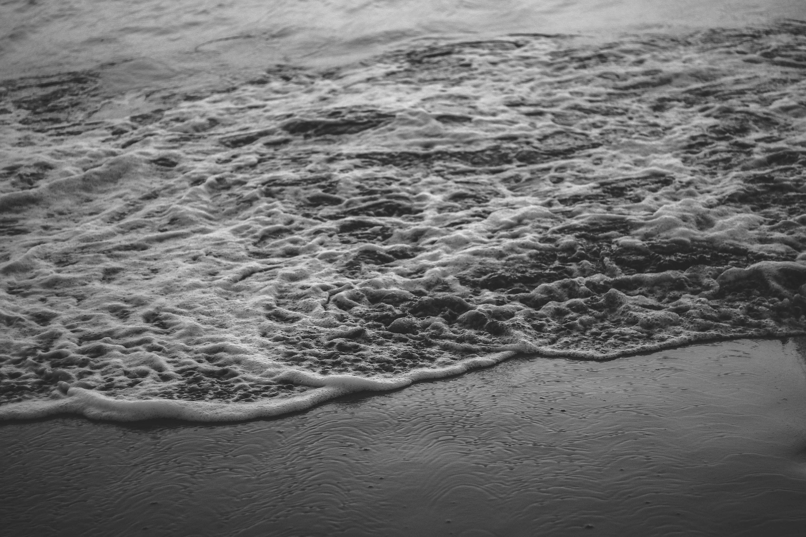

## 小介

<!--<blockquote>
  

    Perfection is achieved, not when there is nothing more to add, but when there is nothing left to take away.
  

  <footer><cite title="Antoine de Saint-Exupéry">Antoine de Saint-Exupéry</cite></footer>
</blockquote> -->

哈囉，謝謝你來拜訪這個網站。  
我是 Adrian，這名字的由來是因為小時候不喜歡幼稚園老師取的英文名字，  
於是升高一時，決定要幫自己重新取浪漫一點的。  

Adrian 這名字的由來是亞得里亞海，  
地中海的一個小水域、分隔了義大利和巴爾幹半島。  

## 由來

我開了個人部落格，臉書搜尋: [海的學習手札](https://www.facebook.com/adriaticsea2017/)，會放一些攝影或音樂（非主流），然後這個網站主要是放些code、或是我能看得懂的數學式子。總之會把這個網站得美美的！希望大家可以多多支持！  

## LICENSE

Pixyll is a simple, beautiful theme for Jekyll that emphasizes content rather than aesthetic fluff. It's mobile _first_, fluidly responsive, and delightfully lightweight.

It's pretty minimal, but leverages large type and drastic contrast to make a statement, on all devices.

## Where is it?

This Jekyll theme was crafted with <3 by [John Otander](http://johnotander.com)
([@4lpine](https://twitter.com/4lpine)).

Checkout the [Github repository](https://github.com/johnotander/pixyll) to download it, request a feature, or report a bug.

It's free, and open source ([MIT](http://opensource.org/licenses/MIT)).
